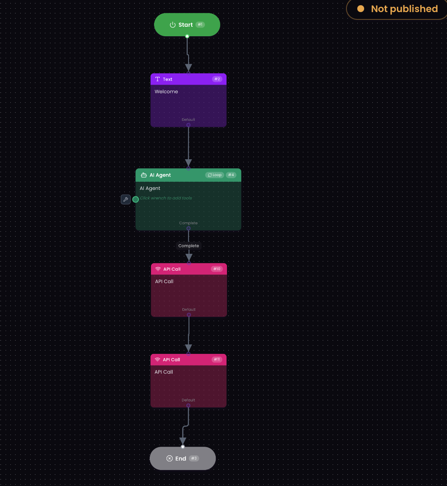
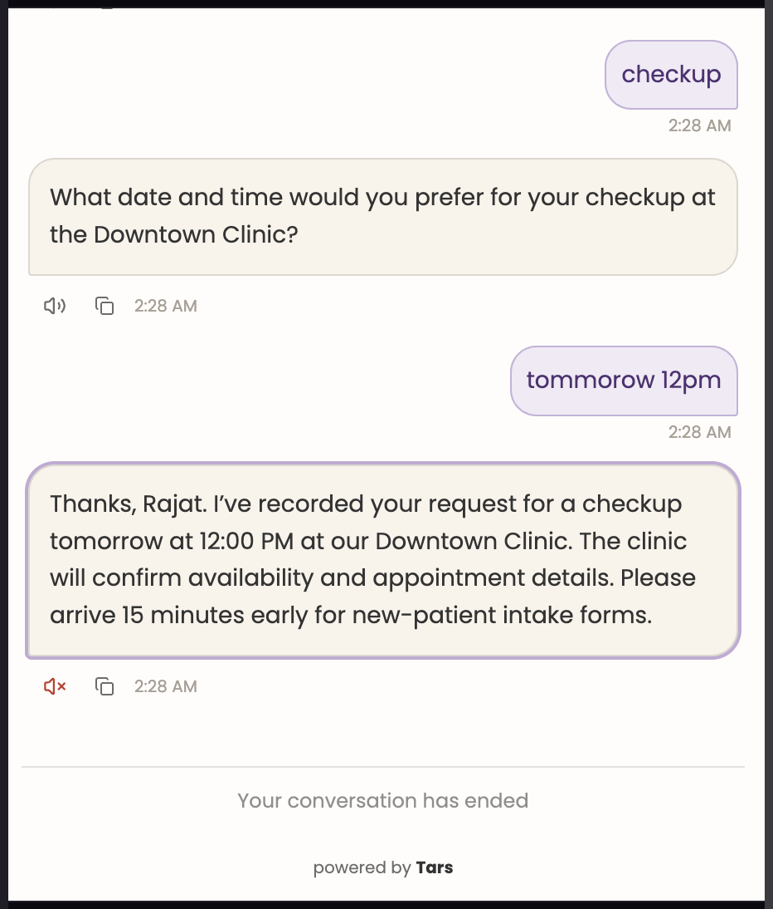

# 🦷 Apex Dental Care: Guardrailed Conversational AI Agent

An end-to-end conversational AI Agent built on TARS that handles patient intake, appointment 
booking, and lead qualification for a fictional multi-location dental clinic — with hard safety 
guardrails and a custom Salesforce CRM integration.

This project tackles the challenge of building a healthcare-facing AI agent that stays useful and 
natural in conversation while never crossing into unsafe territory — no diagnosis, no medical 
advice, and automatic redirection to emergency care when a genuine dental emergency is detected. 
On the backend, it demonstrates root-cause debugging of a real-world CRM integration failure, 
moving from a broken no-code connector to a working custom OAuth flow.

`TARS` `AI Agent` `Conversational AI` `Salesforce API` `OAuth 2.0` `Lead Scoring` `Guardrails`

---

## 🖥️ Live Agent

> Natural-language patient intake with silent lead classification, deployed as a conversational agent.

**[Try the live agent →](your-agent-link-here)**  
**[Watch the demo (Loom) →](your-loom-link-here)**

---

## 🧠 How It Works

The agent runs on a single self-looping **AI Agent** node governed by a structured three-part 
system prompt:

| Component | Purpose |
|---|---|
| **Persona** | Embedded knowledge base — locations, hours, services, insurance, pricing |
| **Instructions** | New vs. existing patient handling, one-field-at-a-time appointment collection, silent lead classification |
| **Constraints** | Hard safety rules — no diagnosis, no medication advice, no claiming access to medical records, nothing invented outside the knowledge base |

Rather than a rigid decision tree, the agent uses natural language understanding — so a message 
like *"I'm visiting for the first time actually"* is correctly understood as new-patient intent 
without needing an exact keyword or button click.

---

## 💬 Sample Conversation

## 🖥️ Live Agent

> Natural-language patient intake with silent lead classification, deployed as a conversational agent.

 
**[Watch the demo (Loom) →](https://www.loom.com/share/56cf7b0408a646b0a2d846c1bfa5671d)**

---

## 🧠 How It Works

The agent runs on a single self-looping **AI Agent** node governed by a structured three-part 
system prompt:

| Component | Purpose |
|---|---|
| **Persona** | Embedded knowledge base — locations, hours, services, insurance, pricing |
| **Instructions** | New vs. existing patient handling, one-field-at-a-time appointment collection, silent lead classification |
| **Constraints** | Hard safety rules — no diagnosis, no medication advice, no claiming access to medical records, nothing invented outside the knowledge base |

Rather than a rigid decision tree, the agent uses natural language understanding — so a message 
like *"I'm visiting for the first time actually"* is correctly understood as new-patient intent 
without needing an exact keyword or button click.

---

## 🚨 Safety Guardrail

The behavior I'm proudest of: if a patient mentions a symptom like **severe bleeding**, the agent 
refuses to book a routine appointment — even if explicitly asked to — and instead redirects them 
to emergency care. This guardrail holds even under direct pressure to override it.

---

## 🎯 Lead Qualification

Once enough information is collected, the agent silently classifies each lead as **HOT**, **WARM**, 
or **COLD** based on booking intent and urgency — not just symptom severity — so a mild, months-old 
concern isn't flagged the same as an urgent same-day request. This classification is never shown 
to the patient; it exists purely for the sales team.

---

## 🔌 Salesforce CRM Integration

| Step | Outcome |
|---|---|
| **1. Native TARS Salesforce tool** | Authenticated correctly, but field-mapping UI didn't support variable interpolation — required fields were sent empty |
| **2. Custom two-step API integration** | Get OAuth token → Create Lead. Failed with `invalid_grant` |
| **3. Root cause found** | Org uses the newer **External Client App** framework, which doesn't support the OAuth flow originally used |
| **4. Fix** | Switched to **OAuth 2.0 Client Credentials flow** with a Run-As user — integration works end to end |

Every conversation that qualifies as a lead creates a real Salesforce Lead record — name, contact 
details, and lead temperature populated directly in the Rating field for the sales team to act on.

📄 [Full integration write-up →](integrations/salesforce-integration.md)

---

## 🗂️ Repository Structure

apex-dental-care-ai-agent/
├── system-prompt/ → Persona, Instructions, Constraints
├── flow/ → Canvas diagram + gambit structure
├── integrations/ → Salesforce debugging write-up
├── demo/ → Loom transcript + demo link
└── assets/ → Screenshots

---

## 💡 Key Takeaway

When a native, no-code integration fails, checking the platform's execution logs first — rather 
than assuming the connector itself is broken — surfaces the real issue faster. The same discipline 
applied to the OAuth failure: isolating variables one at a time (credentials, tokens, network, app 
framework) before finding the actual root cause.

---

**Built by [Rajat Murhe](https://github.com/rajatmurhe)** 
